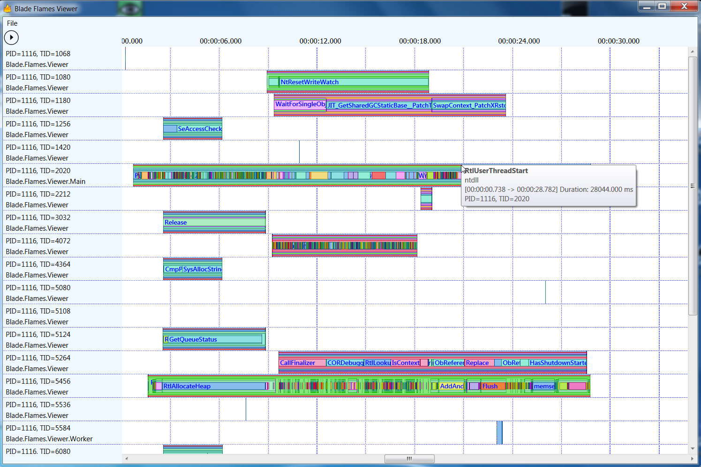
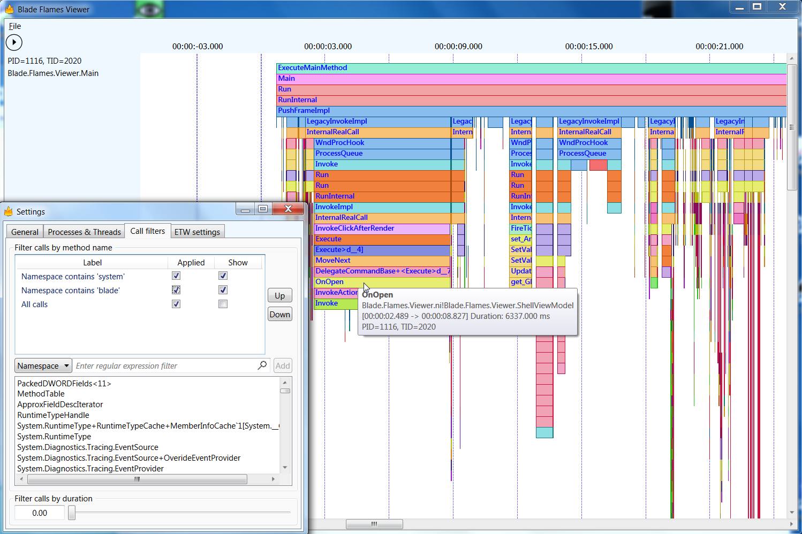

# X-Ray vision for your Apps' runtime

Do you want to know what is really going on in your app at runtime?
Of course sematic traces can give you a great insight.
And if you dont have any profilers like Windows Performance Analyser can provide nice insights too.

But wouldnt it be great if you could just "see" the control flow in a natural way?

Plainion.Flames gives you exactly that view:

## Installation

Just download the [latest release](https://github.com/plainionist/Plainion.Flames/releases), unpack it where ever you want and launch it.

## Usage

Plainion.Flames is an extensible "trace viewer". Out of the box it supports ETW traces e.g. produced with
PerfView or Windows Performance Recorder.

But you can also make it load your custom semantic traces by

- Implementing "IStringTraceParser" (you need to link to Plainion.Flames.Modules.StringTracing)
- export it via MEF
- put it into an assembly with the naming convention: "Plainion.Flames.Modules.*.dll"
- and put this into the folder where you unpacked Plainion.Flames

Plainion.Flames will then visualize your custom semantic traces!

# References

The idea of the visualization is based on [FlameGraph](http://www.brendangregg.com/FlameGraphs/cpuflamegraphs.html).

