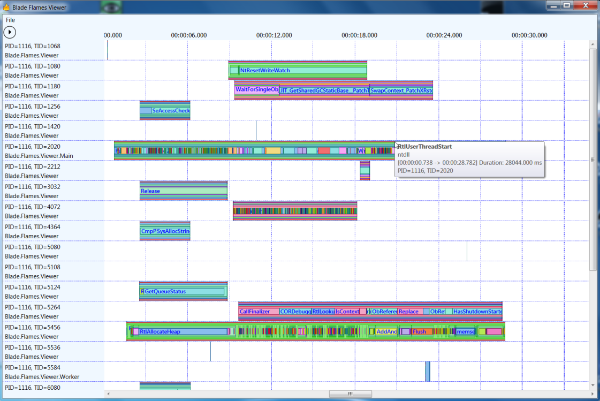

Do you want to know what is really going on in your app at runtime?
Of course sematic traces can give you a great insight.
And if you dont have any profilers like Windows Performance Analyser can provide nice insights too.

But wouldnt it be great if you could just "see" the control flow in a natural way?

Plainion.Flames gives you exactly that view:

## Installation

- download the [latest release](https://github.com/plainionist/Plainion.Flames/releases) and unpack it somewhere
- start the Plainion.Flames.Viewer.exe

## Usage

Plainion.Flames is an extensible "trace viewer". Out of the box it supports ETW traces e.g. produced with
PerfView or Windows Performance Recorder.
To load custom semantic traces see [Extensibility](Development.md).

Once loaded you can navigate the traces using

- mouse wheel to zoom in and out
- left mouse button to zoom in
- use context menu "row header" to expand and collapse flames
- use context menu "row header" to rename or hide threads

Click the triangle or the arrow button in the upper left corner to open the settings dialog.
You will find further setting and trace filtering options there.

